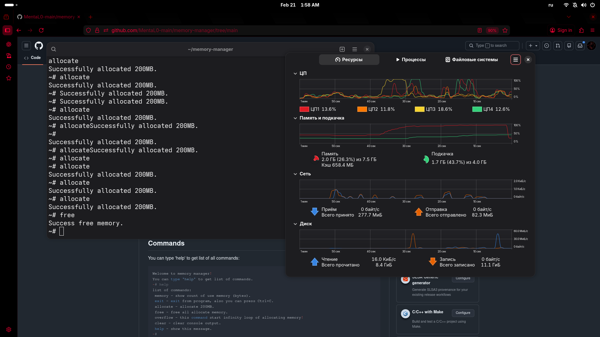

# Memory manager

Memory manager is a small utility that allows you to allocate memory, free it, and prevent overflows.



## Commands
You can type 'help' to get list of all commands:

```bash
Welcome to memory manager!
You can type 'help' to get list of commands.
~# help
list of commands:
 memory - show count of use memory (bytes).
 exit - exit from program, also you can press Ctrl+C.
 allocate - allocate 200MB.
 free - free all allocate memory.
 overflow - this command start infinity loop of allocating memory!
 clear - clear console output.
 help - show this message.
~# 
```

## Quick start
1) Clone repository and move to dir
```bash
git clone https://github.com/mental0-main/memory-manager.git
cd memory-manager
```

2) Compile with gcc/clang
```bash
gcc -o memory-manager main.c
```

3) Execute and use
```bash
./memory-manager
```

## License
This project is licensed undedr the **MIT License**.
